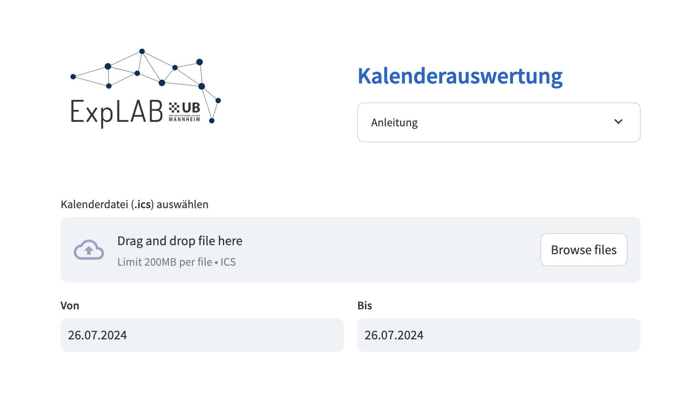
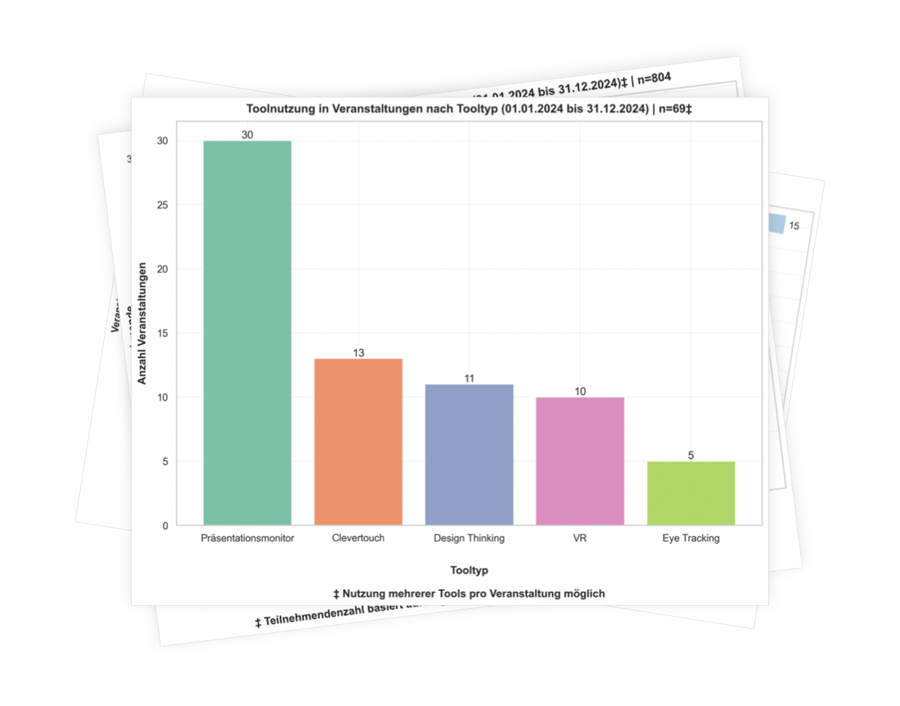

# LABcal: Automated Calendar Analysis

[](https://creativecommons.org/licenses/by/4.0/) [](https://mybinder.org/v2/gh/tsmdt/labcal.git/HEAD)

**LABcal** is a `streamlit` web app that parses iCalendar files (`.ics`) and returns various statistical plots that are based on a `dict` like structure in the calendar field `DESCRIPTION`.

The app was created as a final project for the [Data Librarian](https://www.th-koeln.de/weiterbildung/zertifikatskurs-data-librarian_63393.php) certificate course organised by [TH Köln](https://www.th-koeln.de/en/) in 2023/24. It serves to simplify the generation of user statistics for the Education Lab [ExpLAB](https://www.bib.uni-mannheim.de/standorte/explab-schloss-schneckenhof/) at the [University Library Mannheim](https://www.bib.uni-mannheim.de/en/).

<p align="center">
  
  
</p>

## Usage

Start **LABcal** by either running the `streamlit` app from the terminal (see [installation instructions](#installation) below) or by running the jupyter notebook code demo through `binder`: 

[](https://mybinder.org/v2/gh/tsmdt/labcal.git/HEAD)

## Repository layout

```{markdown}
project_dir /
├── assets /
├── data /
│   └── dummy_cal.ics        # Calendar with anonymised data
├── labcal /                 # LABcal python package
│   ├── __init__.py
│   ├── plot_cal.py          # Plotting functions
│   └── process_cal.py       # Data processing functions
├── app.py                   # LABcal streamlit app
├── labCal_notebook.ipynb    # Code demo (jupyter notebook)
├── LICENSE
├── README.md
└── requirements.txt
```

## Requirements

Python >= 3.10

## Installation

### 1. Clone this repository

```{shell}
git clone https://github.com/tsmdt/labcal.git
```

### 2. Change to project folder

```{shell}
cd labcal
```

### 3. Create a Python virtual environment

```{python}
python3 -m venv venv
```

### 4. Activate the Python virtual environment

```{shell}
source venv/bin/activate
```

### 5. Install dependencies

```{python}
pip install -r requirements.txt
```

### 6. Run the Jupyter notebook

```{shell}
jupyter notebook labCal_notebook.ipynb
```

### 7. Or start the Streamlit app

```{shell}
streamlit run app.py
```

## License

Licensed under [CC BY 4.0](https://creativecommons.org/licenses/by/4.0/deed.en).

## Links

* [University Library Mannheim](https://www.bib.uni-mannheim.de/en/)
* [TH Köln](https://www.th-koeln.de/en/)
* [Zertifikatskurs Data Librarian](https://www.th-koeln.de/weiterbildung/zertifikatskurs-data-librarian_63393.php)
